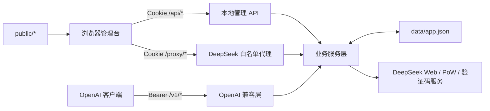

# 架构说明

## 总览

deepseek2api 是单进程、无第三方运行时依赖的 Node.js HTTP 服务。浏览器管理台、会话 API、OpenAI 兼容层和 DeepSeek 代理共享同一进程与同一份 JSON 状态。

## 入口与路由

`src/server.js` 创建原生 HTTP Server，并按路径分发：

- `/api/*`：公共认证、本地用户、账号、密钥和管理员接口。
- `/proxy/*`：需要会话 Cookie 的 DeepSeek Web 白名单代理。
- `/v1/*`、`/models`：需要本地 Bearer API Key 的 OpenAI 兼容接口，包括 `/v1/chat/completions` 与 `/v1/responses`。
- 其他路径：从 `public/` 提供静态资源。

服务统一处理 CORS 预检、Cookie 解析、错误响应和静态资源缓存头。

## 主要组件

### 路由层

- `auth-routes.js`：登录、注册、退出、发现和协议清单。
- `private-routes.js`：账号、API Key、请求日志、验证码、无痕和用户实验开关。
- `admin-routes.js`：注册策略、邀请码、用户限制、共享账号和系统设置。
- `openai-routes.js`：模型列表和 Chat Completions。
- `proxy-routes.js`：代理白名单、账号范围、流式转发和无痕清理。

### 服务层

- 认证与所有权：`auth-service.js`、`user-service.js`、`session-service.js`。
- 账号与密钥：`account-service.js`、`api-key-service.js`、`account-rotation-service.js`。
- 上游协议：`deepseek-proxy.js`、`deepseek-protocol.js`、`deepseek-device.js`。
- OpenAI 桥接：`openai-bridge.js`、`openai-completion-runner.js`、`openai-responses.js`（Responses API 兼容）、工具调用相关服务。
- 会话继续：`continue-service.js` 记录响应到 DeepSeek 会话的映射，支持显式 `previous_response_id` 与前缀匹配自动继续。
- 风控：`pow-solver.js`、`captcha-service.js`、`deepseek-settings.js`。
- 策略：请求限制、无痕模式、共享账号模式和专家提示词覆写。

### 存储层

`src/storage/store.js` 负责读取、规范化和原子业务视角下的状态更新。底层文件是 `data/app.json`；首次读取时自动创建默认结构。

主要状态分区：

| 字段 | 内容 |
| --- | --- |
| `accounts` | 绑定账号、上游 token、客户端档案和验证码状态 |
| `apiKeys` | 本地 Key 哈希、绑定关系、使用统计和工具调用开关 |
| `users` | 本地用户、密码哈希、启用状态和请求限制 |
| `sessions` | 管理台登录会话与过期时间 |
| `invites` / `registration` | 邀请码与注册策略 |
| `incognito` | 全局及用户级无痕设置 |
| `sharedAccountMode` | 共享账号轮询开关 |
| `systemSettings` | 验证码和全局实验设置 |
| `chainOfThoughtOverride` | 用户级实验设置 |

读取旧状态时会执行兼容迁移，例如移除旧版 API Key 明文字段、按安全策略处理账号凭据并补齐客户端档案。

## OpenAI 请求流

1. 从 `Authorization: Bearer ...` 解析本地 API Key，并通过哈希查找记录。
2. 应用用户禁用、并发和每分钟请求限制。
3. 根据普通模式或共享账号模式选择可用账号。
4. 校验模型、搜索选项、工具调用权限和图片输入。
5. 把 OpenAI messages 转换为上游 prompt，必要时上传图片。
6. 尝试会话继续：优先解析 `previous_response_id` / `continue_from`，其次对开头用户消息做前缀匹配；命中则调用 DeepSeek `/chat/continue` 复用会话，否则新建会话并调用 `/chat/completion`。
7. 把上游结果转换为非流式 JSON 或 SSE chunk（chat 或 Responses 格式）。
8. 更新 API Key 当日使用量和内存请求日志；无痕模式下删除上游会话，否则注册会话供后续继续。

## 原生代理请求流

1. 使用 `ds_reverse_session` Cookie 解析本地会话。
2. 将 `/proxy/...` 映射到当前 `DEEPSEEK_API_VERSION`，并检查白名单。
3. 在当前用户可见账号中解析 `x-proxy-account-id`。
4. 生成账号稳定客户端档案和单次请求 ID / trace ID。
5. 对受保护路径附加 PoW 结果，并分类认证、验证码和限流响应。
6. 过滤不应转发给浏览器的 hop-by-hop / Cookie 响应头后返回结果。

## 状态与并发限制

- JSON 存储适合单实例、低并发部署，不提供跨进程锁或多实例一致性。
- 请求限制计数和请求日志保存在内存中，重启后清零。
- 请求日志最多保留 500 条；普通用户只能看到自己的记录，管理员可以看到全部记录。
- 多实例部署会造成状态覆盖、轮询与限流不一致，当前不支持。
